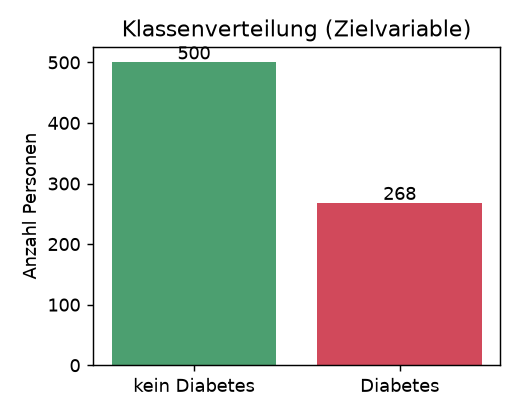
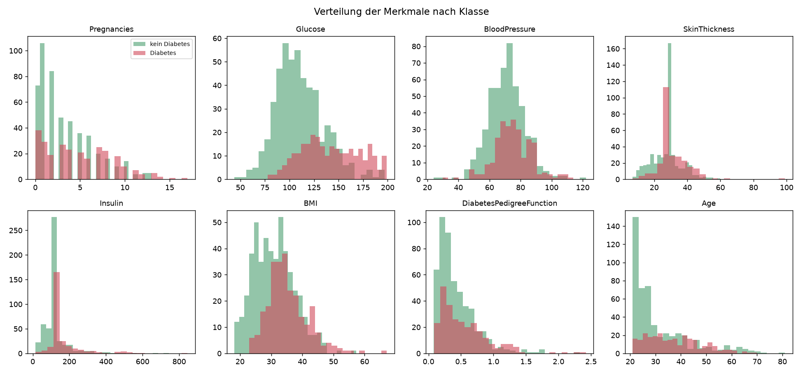
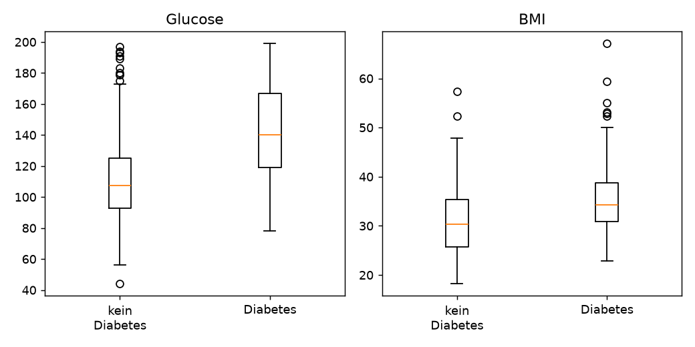
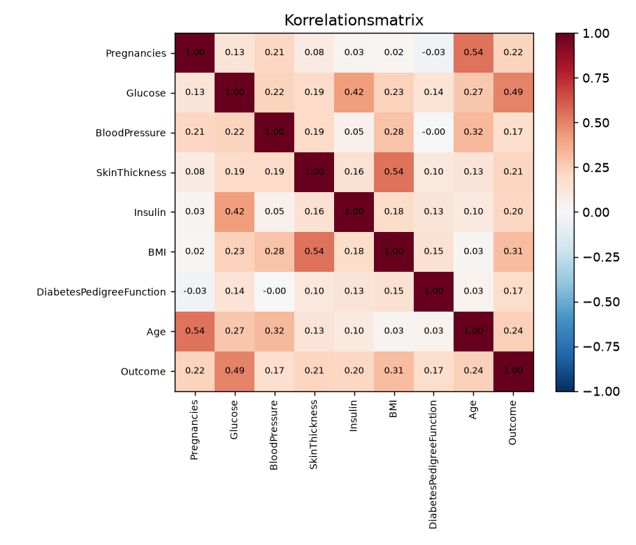
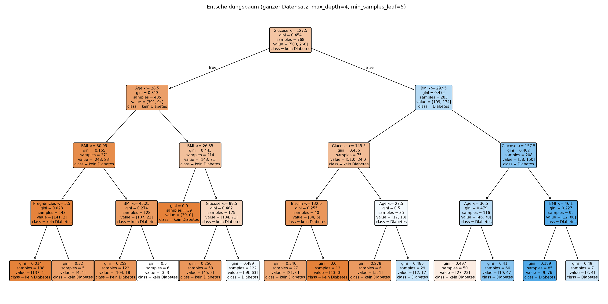
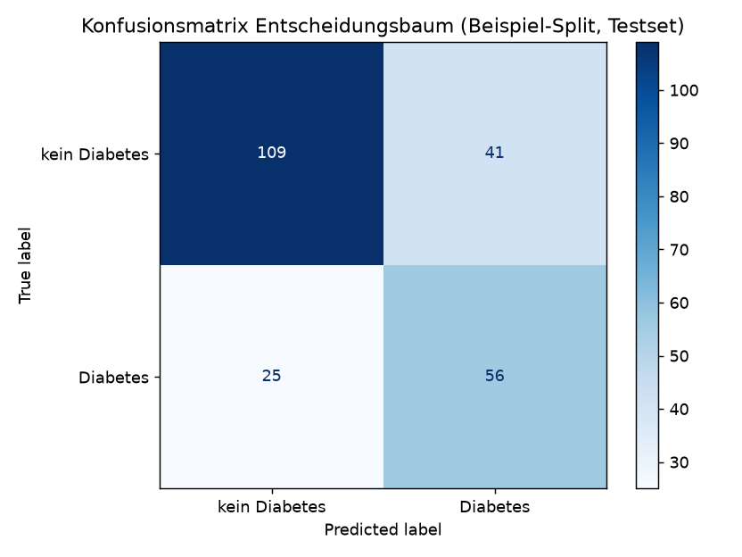
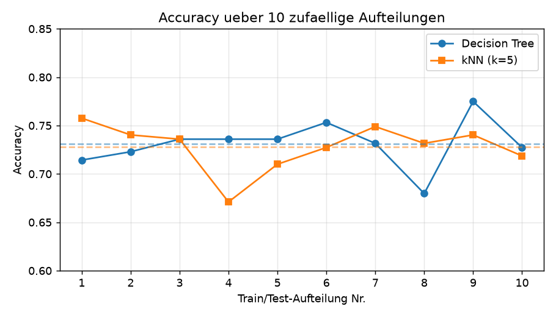

# Diabetes-Früherkennung mit einem Entscheidungsbaum

**Informatik – Leistungsbeurteilung 2, Frühlingssemester 2026**
**Datenanalyse-Projekt mit Orange**

*Autor: [Name eintragen] · Abgabedatum: [Datum eintragen]*

---

## 1. Zielsetzung & Motivation

In meiner Familie ist Typ-2-Diabetes ein wiederkehrendes Thema: Mein Grossvater
hat die Diagnose erst sehr spät erhalten, als bereits Folgeschäden aufgetreten
waren. Bei einem Familientreffen meinte ein Onkel halb im Scherz, man müsste
„doch eigentlich schon vorher sehen können, wer gefährdet ist". Genau diese
Aussage hat mich zu meiner Fragestellung gebracht.

Diabetes entwickelt sich schleichend. Eine ärztliche Abklärung mit oralem
Glukosetoleranztest ist aufwändig und wird oft erst gemacht, wenn schon
Beschwerden bestehen. Ein einfaches Modell, das aus **leicht erhebbaren
Routinedaten** (Blutzucker, Body-Mass-Index, Alter, Anzahl Schwangerschaften
usw.) eine erste Risikoeinschätzung gibt, könnte als **Vorfilter** dienen:
Personen mit hohem Risiko würden gezielt zur genaueren Abklärung geschickt.

> **Konkrete Fragestellung:** Lässt sich allein aus einfachen
> Gesundheitskennzahlen mit einem Entscheidungsbaum vorhersagen, ob eine Person
> an Diabetes erkrankt ist? Welche Merkmale sind dabei am aussagekräftigsten,
> und wie verlässlich wäre ein solches Modell als Screening-Werkzeug?

Das Ziel ist also **nicht**, einen Arzt zu ersetzen, sondern ein gut
erklärbares, nachvollziehbares Modell zu bauen und kritisch zu beurteilen, ob
es als günstiger Vorfilter taugen würde.

---

## 2. Präsentation und Realisierung (PPDAC-Zyklus)

### 2a. Problem

Es handelt sich um ein **binäres Klassifikationsproblem**. Die Zielvariable
`Outcome` hat zwei Ausprägungen:

- `0` = kein Diabetes
- `1` = Diabetes

Ich möchte diese Zielvariable aus den übrigen acht Merkmalen vorhersagen. Als
Hauptmodell verwende ich – wie im Unterricht behandelt – einen
**Entscheidungsbaum (Decision Tree)**, weil er besonders gut **erklärbar** ist:
Man kann jede Entscheidung als Folge von einfachen Ja/Nein-Fragen ablesen, was
in einem medizinischen Kontext (Vertrauen, Nachvollziehbarkeit) entscheidend
ist. Zum Vergleich ziehe ich später ein **kNN-Modell** heran.

### 2b. Planung

**Welche Daten brauche ich?** Ich brauche einen Datensatz, der pro Person
sowohl einfache Gesundheitskennzahlen als auch die gesicherte Diagnose
(Diabetes ja/nein) enthält.

**Herkunft der Daten.** Ich verwende den **„Pima Indians Diabetes"-Datensatz**,
der auf Kaggle frei verfügbar ist (Quelle: Kaggle / UCI Machine Learning
Repository; ursprünglich erhoben vom *National Institute of Diabetes and
Digestive and Kidney Diseases*, USA). Die Daten stammen von **768 Frauen**, die
mindestens 21 Jahre alt sind und der Bevölkerungsgruppe der Pima
(Indigene aus Arizona) angehören. Diese Gruppe hat eine aussergewöhnlich hohe
Diabetes-Rate und wird deshalb seit den 1960er-Jahren medizinisch untersucht.
Die Diagnose (`Outcome`) wurde nach den Kriterien der
Weltgesundheitsorganisation gestellt.

> **Wichtige Einschränkung der Datenerhebung (bereits hier bedacht):** Der
> Datensatz enthält **nur Frauen einer einzigen Bevölkerungsgruppe**. Ein darauf
> trainiertes Modell ist deshalb nicht ohne Weiteres auf Männer oder andere
> Bevölkerungsgruppen übertragbar. Das ist für die spätere Risikobeurteilung
> zentral.

Die **acht Merkmale (Features)**:

| Merkmal | Bedeutung | Typ |
|---|---|---|
| `Pregnancies` | Anzahl Schwangerschaften | ganzzahlig |
| `Glucose` | Blutzucker (Plasmaglukose, 2 h nach Test) | mg/dl |
| `BloodPressure` | diastolischer Blutdruck | mm Hg |
| `SkinThickness` | Hautfaltendicke am Trizeps | mm |
| `Insulin` | Seruminsulin (2 h) | µU/ml |
| `BMI` | Body-Mass-Index | kg/m² |
| `DiabetesPedigreeFunction` | Mass für familiäre Vorbelastung | Zahl |
| `Age` | Alter | Jahre |

**Plan der Auswertung:** (1) Daten reinigen, (2) explorative Datenanalyse mit
Visualisierungen, (3) Entscheidungsbaum trainieren und bewerten,
(4) 10 zufällige Train/Test-Aufteilungen für stabile Metriken, (5) ein zweites
Modell (kNN) vergleichen, (6) den Baum von Hand mit dem Gini-Mass verifizieren.
Die Umsetzung erfolgt in **Orange** (siehe Workflow-Anleitung im Anhang).

### 2c. Daten (Datenreinigung)

Beim ersten Sichten der Daten (Widget *Data Table* in Orange) fiel auf, dass in
mehreren Spalten der Wert **0** vorkommt – und zwar dort, wo das medizinisch
**unmöglich** ist: Ein Blutzucker, Blutdruck oder BMI von 0 kann nicht
existieren. Solche Nullen sind in Wahrheit **fehlende Messwerte**, die im
Datensatz fälschlich als 0 codiert wurden.

| Spalte | Anzahl „0" (= fehlend) | Anteil |
|---|---|---|
| `Glucose` | 5 | 0.7 % |
| `BloodPressure` | 35 | 4.6 % |
| `SkinThickness` | 227 | 29.6 % |
| `Insulin` | 374 | 48.7 % |
| `BMI` | 11 | 1.4 % |

**Vorgehen bei der Reinigung:**

1. Die unmöglichen Nullen in den fünf obigen Spalten wurden als **fehlende
   Werte** markiert (in Orange: *Preprocess → Impute*, bzw. Spalten als „leer"
   umcodieren). In `Pregnancies` bleibt 0 gültig (eine Frau kann 0
   Schwangerschaften haben), ebenso in `Outcome`.
2. Die fehlenden Werte wurden durch den **Median** der jeweiligen Spalte ersetzt
   (Glucose → 117, BloodPressure → 72, SkinThickness → 29, Insulin → 125,
   BMI → 32.3). Der Median ist robuster gegen Ausreisser als der Mittelwert.

> **Kritische Anmerkung:** Bei `Insulin` fehlen fast **die Hälfte** aller Werte
> und bei `SkinThickness` knapp ein Drittel. Diese Spalten durch den Median
> „aufzufüllen" ist heikel, weil man sehr viele Werte künstlich erzeugt. Eine
> Alternative wäre, diese beiden Spalten ganz wegzulassen. Ich habe sie
> behalten, im Modell zeigt sich aber (siehe Feature-Wichtigkeit), dass der Baum
> sie ohnehin kaum nutzt – ein nachträglicher Beleg, dass die Entscheidung
> vertretbar war.

Es wurden keine Zeilen entfernt; der bereinigte Datensatz umfasst weiterhin alle
**768 Datensätze**. Er ist als `data/diabetes_clean.csv` abgelegt.

### 2d. Analyse

#### Schritt 1 – Explorative Datenanalyse (EDA)

**Klassenverteilung (Abb. 1).** Von 768 Personen haben **500 (65 %) keinen** und
**268 (35 %) Diabetes**. Die Klassen sind also **unausgewogen**. Das ist wichtig:
Ein „dummes" Modell, das immer „kein Diabetes" sagt, käme schon auf **65 %
Accuracy**, ohne irgendetwas gelernt zu haben. Die Accuracy allein ist deshalb
keine ausreichende Bewertungsgrösse – ich betrachte zusätzlich Precision, Recall,
F1 und AUC.

**Verteilung der Merkmale (Abb. 2).** Die Histogramme je Merkmal, getrennt nach
Klasse, zeigen qualitativ und quantitativ: Bei **Glucose** sind die Verteilungen
am deutlichsten verschoben – Diabetikerinnen haben im Schnitt klar höhere Werte.
Auch **BMI**, **Age** und **Pregnancies** unterscheiden sich sichtbar.
`BloodPressure` und `SkinThickness` überlappen dagegen stark, trennen also kaum.

**Boxplots (Abb. 3).** Für die zwei stärksten Merkmale bestätigen Boxplots den
Eindruck: Der Median des Blutzuckers liegt bei Diabetikerinnen deutlich höher,
ebenso (etwas schwächer) beim BMI.

**Korrelationen (Abb. 4).** Die Korrelation jedes Merkmals mit `Outcome`
(quantitativ):

| Merkmal | Korrelation mit Outcome |
|---|---|
| Glucose | **0.49** |
| BMI | 0.31 |
| Age | 0.24 |
| Pregnancies | 0.22 |
| SkinThickness | 0.22 |
| Insulin | 0.20 |
| DiabetesPedigreeFunction | 0.17 |
| BloodPressure | 0.17 |

`Glucose` ist mit Abstand am stärksten mit der Diagnose verbunden – das deckt
sich mit dem medizinischen Wissen und mit der EDA.

#### Schritt 1 (Forts.) – Entscheidungsbaum-Modell

Ich habe in Orange einen **Entscheidungsbaum** (*Tree*-Widget) trainiert. Um den
Baum lesbar und nicht „überangepasst" (overfittet) zu halten, habe ich folgende
Parameter gewählt:

| Parameter (Orange *Tree*) | Wert | Begründung |
|---|---|---|
| Splitting-Kriterium | Gini-Unreinheit | im Unterricht behandelt |
| Maximale Tiefe | 4 | begrenzt Overfitting, hält den Baum lesbar |
| Min. Instanzen pro Blatt | 5 | verhindert winzige, unzuverlässige Blätter |
| Binärer Baum | ja | jede Entscheidung ist eine Ja/Nein-Frage |

Der resultierende Baum (Abb. 5) wählt als **allererste Entscheidung**
`Glucose ≤ 127.5` – also genau das Merkmal, das schon in der EDA am stärksten
trennte. Das ist ein gutes Plausibilitätszeichen.

Die **Feature-Wichtigkeit** des Baums bestätigt das Bild:

| Merkmal | Wichtigkeit im Baum |
|---|---|
| Glucose | 0.61 |
| BMI | 0.24 |
| Age | 0.14 |
| Insulin | 0.01 |
| übrige | ≈ 0 |

Der Baum stützt sich also fast vollständig auf **Glucose, BMI und Age**. Die
Spalten mit vielen fehlenden Werten (`Insulin`, `SkinThickness`) werden – wie in
der Datenreinigung vermutet – praktisch ignoriert.

**Train/Test-Aufteilung.** Ich habe die Daten im Verhältnis **70 % Training /
30 % Test** aufgeteilt (in Orange: *Data Sampler* bzw. *Test & Score* mit
„Random sampling"), und zwar **stratifiziert**, damit das Klassenverhältnis
(35 % Diabetes) in beiden Teilen erhalten bleibt. 70/30 ist ein üblicher
Kompromiss: genug Trainingsdaten, aber auch ein aussagekräftig grosses Testset.

**Bewertung auf dem Testset (Beispiel-Aufteilung).** Die Konfusionsmatrix des
Baums (Abb. 6):

|  | Vorhersage: kein D. | Vorhersage: Diabetes |
|---|---|---|
| **Tatsächlich kein Diabetes** | 109 (richtig negativ) | 41 (falsch positiv) |
| **Tatsächlich Diabetes** | 25 (falsch negativ) | 56 (richtig positiv) |

Daraus ergeben sich die Metriken für diese Aufteilung: **Accuracy 0.71**,
**Precision 0.58**, **Recall 0.69**, **F1 0.63**, **AUC 0.79**.

#### Schritt 2 – Zehn Aufteilungen & Vergleich mit kNN

Eine einzelne Train/Test-Aufteilung ist Zufall: Je nachdem, welche Personen ins
Testset geraten, fallen die Metriken anders aus. Deshalb habe ich – wie gefordert
– **10 zufällige 70/30-Aufteilungen** durchgeführt und die Metriken jeweils
notiert.

**Versuchstabelle Entscheidungsbaum:**

| Aufteilung | Accuracy | Precision | Recall | F1 | AUC |
|---|---|---|---|---|---|
| 1 | 0.714 | 0.577 | 0.691 | 0.629 | 0.788 |
| 2 | 0.723 | 0.660 | 0.432 | 0.522 | 0.788 |
| 3 | 0.736 | 0.602 | 0.728 | 0.659 | 0.785 |
| 4 | 0.736 | 0.600 | 0.741 | 0.663 | 0.788 |
| 5 | 0.736 | 0.632 | 0.593 | 0.612 | 0.782 |
| 6 | 0.753 | 0.875 | 0.346 | 0.496 | 0.813 |
| 7 | 0.732 | 0.642 | 0.531 | 0.581 | 0.804 |
| 8 | 0.680 | 0.533 | 0.704 | 0.606 | 0.719 |
| 9 | 0.775 | 0.636 | 0.840 | 0.723 | 0.823 |
| 10 | 0.727 | 0.594 | 0.704 | 0.644 | 0.824 |
| **Mittelwert** | **0.731** | 0.635 | 0.611 | **0.614** | **0.791** |
| **Minimum** | 0.680 | 0.533 | 0.346 | 0.496 | 0.719 |
| **Maximum** | 0.775 | 0.875 | 0.840 | 0.723 | 0.824 |

**Vergleich Entscheidungsbaum ↔ kNN** (kNN mit k = 5; da kNN distanzbasiert ist,
wurden die Merkmale vorher **normiert** – in Orange via *Preprocess → Normalize*):

| Metrik (Ø über 10 Splits) | Entscheidungsbaum | kNN (k=5) |
|---|---|---|
| Accuracy | **0.731** (0.680 – 0.775) | 0.728 (0.671 – 0.758) |
| F1 | **0.614** (0.496 – 0.723) | 0.599 (0.553 – 0.623) |
| AUC | **0.791** (0.719 – 0.824) | 0.779 (0.747 – 0.806) |

**Interpretation des Vergleichs.** Im **Durchschnitt** ist der Entscheidungsbaum
in allen drei Metriken leicht besser. Auffällig ist aber die **Streuung**: Beim
Baum schwankt der F1-Wert von 0.50 bis 0.72, beim kNN nur von 0.55 bis 0.62. Der
**kNN ist also stabiler/robuster**, der Baum dafür im besten Fall etwas
treffsicherer und – sein grosser Vorteil – **erklärbar**. kNN trifft seine
Entscheidung dagegen „blackbox-artig" über die 5 nächsten Nachbarn und liefert
keine ablesbare Regel. Für ein medizinisches Screening, bei dem
Nachvollziehbarkeit zählt, spricht das für den Entscheidungsbaum.

#### Schritt 3 – Verifikation mit dem Gini-Unreinheitsmass (von Hand)

Um zu überprüfen, ob Orange korrekt rechnet, habe ich das **gewichtete
Gini-Unreinheitsmass** für zwei mögliche erste Entscheidungen von Hand berechnet.

Das Gini-Mass eines Knotens mit Anteil *p* der einen Klasse ist
**Gini = 1 − p² − (1 − p)²**. Für einen Split berechnet man das **gewichtete**
Gini der beiden Kindknoten (gewichtet nach Anzahl Datensätze).

**Ausgangslage – Wurzelknoten (alle 768 Personen):** 268 mit, 500 ohne Diabetes.

$$Gini_{Wurzel} = 1 - \left(\tfrac{268}{768}\right)^2 - \left(\tfrac{500}{768}\right)^2 = 1 - 0.349^2 - 0.651^2 = \mathbf{0.4544}$$

**(a) Vom Modell gewählte erste Entscheidung: `Glucose ≤ 127.5`**

| Ast | Anzahl | davon Diabetes | davon kein D. | Gini |
|---|---|---|---|---|
| `Glucose ≤ 127.5` (links) | 485 | 94 | 391 | 1 − (94/485)² − (391/485)² = **0.3125** |
| `Glucose > 127.5` (rechts) | 283 | 174 | 109 | 1 − (174/283)² − (109/283)² = **0.4736** |

$$Gini_{gew} = \tfrac{485}{768}\cdot 0.3125 + \tfrac{283}{768}\cdot 0.4736 = 0.197 + 0.175 = \mathbf{0.3719}$$

**Informationsgewinn** = 0.4544 − 0.3719 = **0.0825**.

**(b) Frei gewählte Alternative: `BMI ≤ 30`** (klinische Adipositas-Grenze)

| Ast | Anzahl | davon Diabetes | davon kein D. | Gini |
|---|---|---|---|---|
| `BMI ≤ 30` (links) | 292 | 51 | 241 | 1 − (51/292)² − (241/292)² = **0.2883** |
| `BMI > 30` (rechts) | 476 | 217 | 259 | 1 − (217/476)² − (259/476)² = **0.4961** |

$$Gini_{gew} = \tfrac{292}{768}\cdot 0.2883 + \tfrac{476}{768}\cdot 0.4961 = 0.110 + 0.308 = \mathbf{0.4171}$$

**Informationsgewinn** = 0.4544 − 0.4171 = **0.0373**.

**Überprüfung – stimmt die Baumstruktur?** Ja. Die Entscheidung `Glucose ≤ 127.5`
hat das **kleinere** gewichtete Gini (0.3719 < 0.4171) und damit den **grösseren
Informationsgewinn** als die Alternative `BMI ≤ 30`. Genau deshalb wählt Orange
`Glucose` als erste Entscheidung – meine Handrechnung bestätigt die Struktur des
Baums und damit, dass das Modell sinnvoll aufgebaut ist. (Die in Abb. 5
abgelesenen Knoten-Gini-Werte 0.454, 0.312 und 0.474 stimmen exakt mit der
Handrechnung überein.)

### 2e. Schlussfolgerungen

**Ist die Fehlerquote akzeptabel?** Das Modell erreicht im Mittel **73 %
Accuracy** und eine **AUC von 0.79**. Gemessen an der „Dummy-Schwelle" von 65 %
(immer „kein Diabetes") lernt das Modell also tatsächlich etwas Nützliches, ist
aber **weit von medizinischer Verlässlichkeit entfernt**.

**Welche Fehlerart ist gefährlich?** Hier liegt das eigentliche Problem. Der
**Recall** (Anteil der erkannten Diabetiker) ist mit im Schnitt **0.61** und im
schlechtesten Fall nur **0.35** niedrig. Das heisst: Das Modell **übersieht
einen erheblichen Teil der tatsächlich Erkrankten** (falsch-negative Fälle). In
einem Screening ist gerade das die **teuerste Fehlerart**: Eine Person wird
fälschlich beruhigt und geht nicht zur Abklärung. Ein falsch-positiver Fall
(unnötige Abklärung) ist dagegen weit weniger schlimm. Ein reales
Screening-Modell müsste deshalb auf **hohen Recall** getrimmt werden, auch auf
Kosten der Precision.

**Wo macht das Modell die meisten Fehler?** Vor allem im **„Graubereich"**:
Personen mit mittlerem Blutzucker (knapp unter/über 127.5) und durchschnittlichem
BMI sind schwer einzuordnen, weil sich die Klassen dort stark überlappen
(siehe Histogramme). Eindeutige Fälle (sehr hoher Blutzucker) erkennt der Baum
zuverlässig; die „Wackelkandidaten" in der Mitte sind das Problem.

**Beispielhafte Fehlentscheidung (Rückverfolgung).** Eine Person mit
`Glucose = 130` (also knapp > 127.5) landet sofort im „Risiko"-Ast, selbst wenn
BMI und Alter niedrig sind – sie wird evtl. fälschlich als Diabetikerin
eingestuft (falsch positiv). Umgekehrt rutscht jemand mit `Glucose = 125` aber
sehr hohem BMI in den „kein Risiko"-Ast und wird evtl. übersehen (falsch
negativ). Die **harte Schwelle bei 127.5** ist also eine Hauptfehlerquelle.

**Braucht es mehr/andere Daten?** Ja, beides:
- **Mehr Daten** würden vor allem den hohen Anteil künstlich aufgefüllter
  `Insulin`-/`SkinThickness`-Werte entschärfen.
- **Andere Daten** wären sogar wichtiger: Der Datensatz enthält nur Pima-Frauen
  ≥ 21 Jahre. Für ein allgemein einsetzbares Modell bräuchte man Männer,
  weitere Altersgruppen und Bevölkerungsgruppen, sonst ist das Modell **verzerrt
  (Bias)** und für andere Personen unbrauchbar.

**Wie fällt das Modell Entscheidungen – Erklärbarkeit.** Das ist die grösste
Stärke des Entscheidungsbaums: Jede Vorhersage lässt sich als kurze Kette von
Regeln vorlesen, z. B. *„Glucose > 127.5 UND BMI > 29.95 → Diabetes
wahrscheinlich"*. Diese Transparenz ist im Gesundheitsbereich Gold wert: Ärzte
und Patientinnen können die Begründung nachvollziehen und plausibilisieren. Beim
kNN ist das nicht möglich – es gibt keine ablesbare Regel, nur „die 5 ähnlichsten
Fälle waren mehrheitlich Diabetiker". Genau diese **Nachvollziehbarkeit** war der
Grund, den Entscheidungsbaum als Hauptmodell zu wählen.

**Risiken beim Einsatz.** Ein produktiver Einsatz wäre **fahrlässig**: Bei 39 %
übersehenen Erkrankten (schlechtester Recall) würde das Modell Menschen in
falscher Sicherheit wiegen. Vertretbar wäre höchstens ein Einsatz als
**unverbindlicher Hinweisgeber** zusätzlich zur ärztlichen Beurteilung, niemals
als Ersatz.

**Fazit (auch für Dritte verständlich).** Aus einfachen Gesundheitskennzahlen
lässt sich Diabetes mit einem Entscheidungsbaum **deutlich besser als durch
Raten** vorhersagen (73 % Treffer, AUC 0.79). Der **Blutzucker** ist mit Abstand
das wichtigste Merkmal, gefolgt von BMI und Alter. Das Modell ist transparent und
gut erklärbar, **übersieht aber zu viele echte Erkrankte**, um schon ein
verlässliches Screening zu sein. Es zeigt aber überzeugend, **welche Faktoren
zählen** – und beantwortet damit meine Ausgangsfrage: Ja, eine grobe
Risikoeinschätzung aus Routinedaten ist möglich, eine sichere Diagnose aber nicht.

---

## 3. Reflexion

**Was habe ich gelernt?** Ich habe zum ersten Mal einen vollständigen
Datenanalyse-Prozess (PPDAC) selbst durchlaufen. Am meisten überrascht hat mich,
**wie wichtig die Datenreinigung** ist: Hätte ich die „unmöglichen Nullen" nicht
bemerkt, hätte das Modell z. B. einen Blutdruck von 0 als echten Messwert
behandelt und Unsinn gelernt. Ich habe ausserdem verstanden, **warum Accuracy
allein trügt** (wegen der unausgewogenen Klassen) und weshalb man mehrere
Metriken braucht. Die Gini-Handrechnung hat mir den Entscheidungsbaum erst
wirklich „aufgeschlüsselt" – vorher war er für mich eine Blackbox, jetzt verstehe
ich, *warum* er splittet, wie er splittet.

**Ziele für mein weiteres Lernen.** *Kurzfristig* möchte ich lernen, in Orange
gezielt die Entscheidungsschwelle (z. B. für höheren Recall) zu verschieben und
eine ROC-Kurve sauber zu interpretieren. *Langfristig* reizt es mich,
Klassifikation auch ausserhalb von Orange (z. B. in Python) zu programmieren und
weitere Modelle wie Random Forests zu verstehen.

**Schwierigkeiten und wie ich damit umging.** Die grösste Hürde war die
Entscheidung, was mit den **vielen fehlenden `Insulin`-Werten** geschehen soll.
Ich war unsicher, ob Weglassen oder Auffüllen besser ist. Ich habe mich für das
Auffüllen mit dem Median entschieden und meine Wahl im Nachhinein über die
Feature-Wichtigkeit überprüft (der Baum nutzt `Insulin` kaum – die Entscheidung
war also unkritisch). Zweitens hat mich die **starke Schwankung der Metriken**
zwischen den Aufteilungen zuerst verunsichert; durch die 10 Wiederholungen und
die Mittelwert/Min/Max-Auswertung habe ich gelernt, dass eine einzelne Zahl
wenig aussagt.

**Neue Fragen.** Würde ein anderes Modell (Random Forest) den niedrigen Recall
verbessern? Wie stark verändert sich das Modell, wenn man die Schwelle von 0.5
verschiebt? Und vor allem: Wie geht man fair mit dem **Bias** um, dass die Daten
nur eine einzige Bevölkerungsgruppe abbilden?

---

## Quellen & Hilfsmittel

- **Datensatz:** „Pima Indians Diabetes Database", Kaggle (Spiegelung des UCI
  Machine Learning Repository); Originaldaten: National Institute of Diabetes
  and Digestive and Kidney Diseases (USA).
- **Software:** Orange Data Mining (Version [eintragen]).
- **Begleitende Berechnungen/Abbildungen:** mit Python (scikit-learn, pandas,
  matplotlib) reproduziert; Skript `analysis.py` liegt dem Projekt bei.

> **Offenlegung generativer Hilfsmittel (gemäss Aufgabenstellung):** Für dieses
> Projekt wurde ein KI-Sprachmodell als Hilfsmittel eingesetzt
> (u. a. bei der Datensatzrecherche, beim Aufbau der Analyse-/Auswertungsschritte
> und bei der Strukturierung des Berichts). Die inhaltliche Prüfung,
> Interpretation und Verantwortung für sämtliche Aussagen liegen bei mir. *Der
> Einsatz ist vorgängig mit der Lehrperson abzusprechen und hier entsprechend
> anzupassen.*
